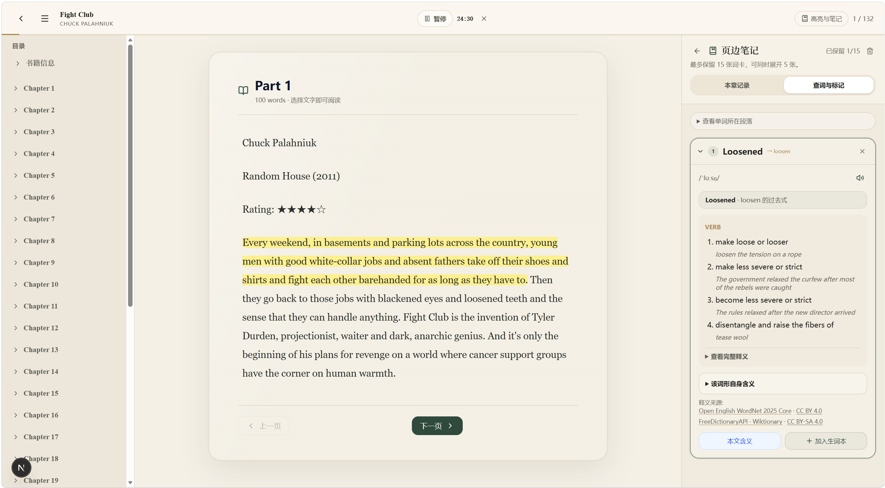
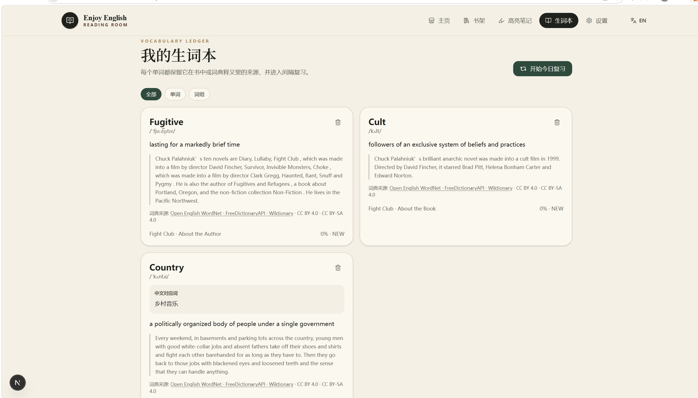
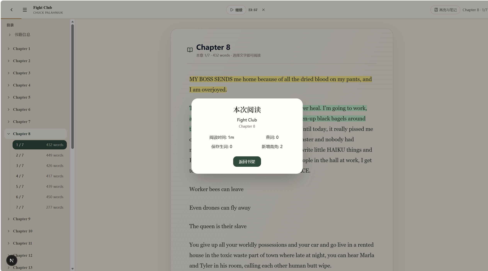

# Enjoy English — Reading Room

**一间属于你的英文阅读室。带一本书进来，慢慢读，随手查，留下笔记。**

Enjoy English — Reading Room 是一个面向中文母语成人学习者的英文精读阅读室。导入自己的 EPUB、TXT 或可提取文字的 PDF，在同一个阅读空间里查词、理解原文、整理高亮、积累生词，并通过间隔复习回顾所学。

界面采用暖色纸张、衬线字体和页边笔记布局，让正文保持在阅读的中心。AI 是可选的理解辅助；阅读、词典、高亮和基础复习无需配置 AI 即可使用。

*A personal reading room for adult Chinese-speaking learners of English. Bring your own books, look up words, collect highlights, and revisit vocabulary with spaced review. AI assistance is optional.*



## 界面预览

以下为实际使用界面截图。书籍内容由用户自行导入，截图中的书籍不随仓库分发；部分功能依赖配置，阅读计时与本次阅读统计需启用 `READING_LEDGER_ENABLED=true`。

<details>
<summary>进入阅读室 · 登录与书架</summary>


</details>

<details>
<summary>开始阅读 · 首页与阅读时长目标</summary>


</details>

<details>
<summary>留下积累 · 生词本与本次阅读统计</summary>





</details>

## 产品目标

帮助用户把一本英文书持续读下去：遇到生词时获得辅助，遇到值得保留的句子时留下高亮，读完后能够回顾自己的积累，并在下次打开时接着读。

当前优先服务 B1–B2 水平的中文母语成人用户。核心学习流程即使没有配置 AI 也应正常使用；AI 只负责按需解释和增强练习，并通过缓存与每日额度控制成本。

## 当前学习流程

1. 导入 EPUB、TXT 或可提取文字的 PDF。
2. 系统解析目录、章节、段落和学习分页。
3. 用户按章节阅读并自动保存进度。
4. 单独选择英文单词，查看英文释义、可用的中文对应词、音标和发音。
5. 将重点单词加入生词本，并保留书籍、章节和上下文来源。
6. 对句子或段落添加红色、黄色或绿色高亮。
7. 在书内或全局高亮页面整理、改色和删除高亮。
8. 完成基础练习和到期复习，更新词汇学习状态。
9. 在需要时主动请求 AI 上下文解释或语法分析。

## 已实现功能

### 电子书导入与书库

- 支持 EPUB、TXT 和可提取文字的 PDF。
- 支持点击选择和拖拽导入单本书籍。
- 展示文件格式、大小、解析状态和阅读进度。
- 自动提取 EPUB 封面、生成 PDF 第一页封面或文字封面。
- 支持上传自定义 JPG、PNG 或 WebP 封面。
- 删除书籍时同步清理本地原文件和封面。

### 精读阅读器

- EPUB 和 TXT 按章节及语义边界拆分学习页。
- 学习分页以约 350–500 个英文单词为目标，并设置硬上限。
- PDF 保留原始页码，避免合并不同 PDF 页面。
- 自动保存当前章节、学习位置和完成进度。
- 重新打开书籍时可以继续上次阅读位置。

### 词典与生词

- 单独选择英文单词后查询词典，支持双语或纯英文显示。
- 结合本地 Open English WordNet 与在线 FreeDictionaryAPI / Wiktionary，显示英文释义、可用的中文对应词、音标和发音。
- 支持常见词形还原，例如 `running → run`、`mice → mouse`、`went → go`；存在歧义时提供候选词。
- 支持从词典释义中继续查询陌生单词。
- 通过右侧词典卡查看释义和原文语境，重复词不会重复添加。
- 保存生词时记录书籍、章节、上下文和来源类型。

### 高亮与整理

- 支持对选中的句子或段落添加红、黄、绿三种高亮。
- 已有高亮可以修改颜色或删除。
- 支持查看单本书的全部高亮。
- 支持跨书籍查看和复习全部高亮。

### 练习与复习

- 无需 AI 即可根据当前章节生成基础选择练习。
- 错误词汇会进入学习状态并安排后续复习。
- 提供生词复习和高亮复习入口。
- 首页展示继续阅读、今日复习和近期学习数据。

### 按需 AI

- 提供统一的 OpenAI-compatible Provider 配置。
- AI 上下文解释由用户主动触发，不在普通阅读时自动消耗额度。
- 支持每日调用上限与结果缓存。
- 可在设置中配置自己的 DeepSeek Key，为词典英文释义生成中文辅助翻译；机器翻译应结合英文原文理解。
- 未配置 API Key、达到额度或 AI 服务失败时，阅读、词典和基础复习仍可工作。

### 邀请制访问与私有存储

- 登录邮箱由 `LOGIN_ALLOWED_EMAILS` 白名单控制。
- 本地开发时验证码输出到启动终端；生产环境通过 Resend 发送。验证码在数据库中只保存摘要。
- 登录状态使用 HttpOnly Cookie；修改数据的接口执行同源检查。
- 新导入的书籍和封面保存在非公开的数据目录，并按账号校验访问权限。

## 当前限制

- 扫描版 PDF 暂不支持 OCR，因此无法提取图片中的文字。
- 加密、损坏或排版复杂的 PDF 可能解析失败或丢失布局信息。
- EPUB 中的复杂图片、公式、脚注和内部链接可能无法完全还原。
- PDF 使用原始页作为学习页，个别页面可能包含过多文字。
- 中文对应词的覆盖因词条而异。在线词典不可用时，本地英文释义仍可使用；音标和音频取决于在线词条及缓存，浏览器语音合成回退也取决于设备支持，不能保证离线发音。
- AI Provider 的真实输出质量、费用和模型兼容性仍需继续验证。
- 视频字幕学习、音频精听、跟读和口语评分不属于当前 MVP 核心范围。

## 技术架构

- Next.js 16 App Router
- React 19
- TypeScript
- Tailwind CSS 4
- Prisma 5
- SQLite
- 本地文件存储
- EPUB、PDF 与纯文本解析
- JWT 与 HttpOnly Cookie 登录状态
- OpenAI-compatible AI Provider

当前阶段保留 Next.js 单体架构、SQLite 和本地文件存储，以较低成本验证完整学习闭环。产品稳定后再考虑迁移 PostgreSQL、对象存储和独立解析服务。

## 本地运行

### 环境要求

- Node.js 20 或更高版本
- npm

本地体验不需要 Resend 账号。只有正式部署并发送真实邮件时，才需要 Resend API Key 和已验证的自有域名。

### 1. 克隆与安装

```bash
git clone https://github.com/Kimjoejjjjj/enjoy-english-reading-room.git
cd enjoy-english-reading-room
npm ci
```

项目会从仓库内固定版本的 Open English WordNet 数据包生成本地词典索引，不需要在安装时下载词典。

### 2. 一键配置本地环境

运行以下命令，它会创建 Git 忽略的 `.env.local`、生成随机登录密钥，并初始化本地数据库：

```bash
npm run setup:local
```

脚本不会覆盖已有的 `.env.local`。默认本地登录邮箱是 `reader@example.local`。

### 3. 启动并登录

```bash
npm run dev
```

打开 `http://localhost:3000`，输入 `reader@example.local` 获取验证码。验证码会以如下格式显示在运行 `npm run dev` 的终端中：

```text
[local-login] Verification code for reader@example.local: 123456
```

复制该六位验证码即可登录。60 秒倒计时只是重新发送的冷却时间；验证码服务端有效期仍为 10 分钟。

### 正式邮件部署

生产环境仍是邀请制，并且不会启用终端验证码。请在服务器环境变量中配置：

```env
LOGIN_ALLOWED_EMAILS="获准登录的邮箱，多个邮箱用逗号分隔"
RESEND_API_KEY="Resend API Key"
RESEND_FROM_EMAIL="login@你已在 Resend 验证的自有域名"
```

生产部署还必须配置长随机 `JWT_SECRET`、`OTP_HASH_SECRET`、持久化 `APP_DATA_DIR` 和正确的 `TRUST_PROXY_HOPS`。详细步骤见 [`docs/vps-invitation-beta.md`](docs/vps-invitation-beta.md)。不要提交 `.env.local` 或任何真实密钥。

### 可选 AI 配置

AI 不是阅读、词典、标记和基础复习的必需条件：

```env
AI_API_KEY=""
AI_BASE_URL="https://api.deepseek.com"
AI_MODEL="deepseek-flash"
AI_PROVIDER="deepseek"
AI_DAILY_LIMIT="20"
AI_QUOTA_ENABLED="false"
```

如果需要保存用户自己的 AI Key，还需设置一个 32 字节 Base64 编码的 `AI_CREDENTIAL_ENCRYPTION_KEY`。真实 API Key 只应写在本机 `.env.local`，不要提交到 Git 仓库，也不要在网页、Issue 或聊天中粘贴。

### 生产部署

生产环境必须使用持久化绝对路径、正确配置反向代理层数，并提供完整的邀请登录配置。部署前请阅读 [`docs/vps-invitation-beta.md`](docs/vps-invitation-beta.md)。本地开发配置不能直接当作生产配置使用。

## 常用命令

```bash
npm run dev
npm run typecheck
npm run test:security
npm run build
```

当前完整 `npm run lint` / `npm run check` 仍会扫描历史备份、压缩后的 PDF 第三方脚本和暂时关闭的旧媒体页面，因此尚未作为公开发布验收命令。当前版本的干净副本已通过依赖安装、数据库初始化、125 项隔离测试、TypeScript、生产构建和本地 HTTP 启动检查；完整 Lint 技术债仍需后续单独收敛。

## 本地数据与隐私

开发环境中的数据库、上传书籍、自动生成封面、临时文件和 `.env` 均被排除在 Git 之外，不会随代码推送到 GitHub。

默认本地数据主要位于：

- `prisma/dev.db`
- `.tmp/app-data/`
- `public/uploads/`（旧版本数据）
- `public/covers/`（旧版本数据）
- `public/temp/`（旧版本数据）

删除或迁移项目前，请根据需要单独备份这些目录和数据库。

## 许可证与第三方数据

项目代码遵循仓库中的 [MIT License](LICENSE)。仓库包含 Open English WordNet 2025 Core 原始数据包，用于离线生成词典索引；该数据集遵循 [CC BY 4.0](https://creativecommons.org/licenses/by/4.0/)，来源、版本和校验值记录在 [`vendor/dictionaries/README.md`](vendor/dictionaries/README.md)。

## 后续方向

1. 扩大 EPUB、TXT 和 PDF 的真实书籍回归测试集。
2. 改进复杂排版、超长 PDF 页面和旧书籍分页迁移。
3. 完善高亮、词汇和章节练习形成的复习闭环。
4. 根据真实使用反馈改进阅读辅助和学习记录展示。

## 产品原则

Enjoy English — Reading Room 始终围绕英文精读展开：让用户选择自己的书，在安静的阅读空间中理解内容、留下记录，并回顾所学。AI 为这个过程提供辅助。

功能数量不是首要目标。阅读、理解、记录、练习、复习和反馈形成稳定闭环，才是项目持续开发的判断标准。
